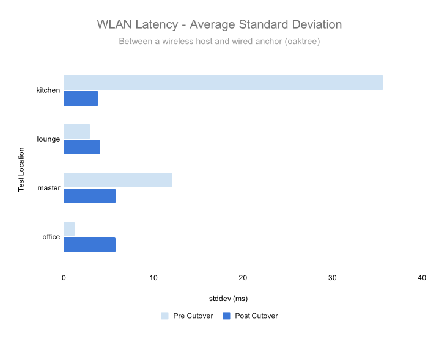
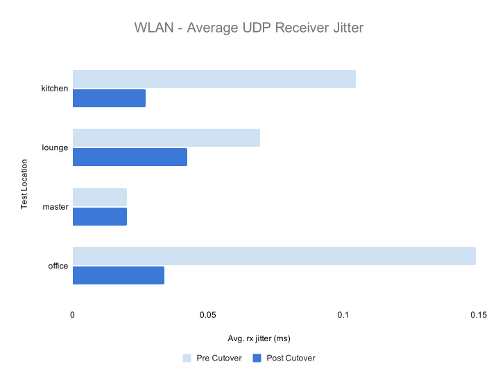
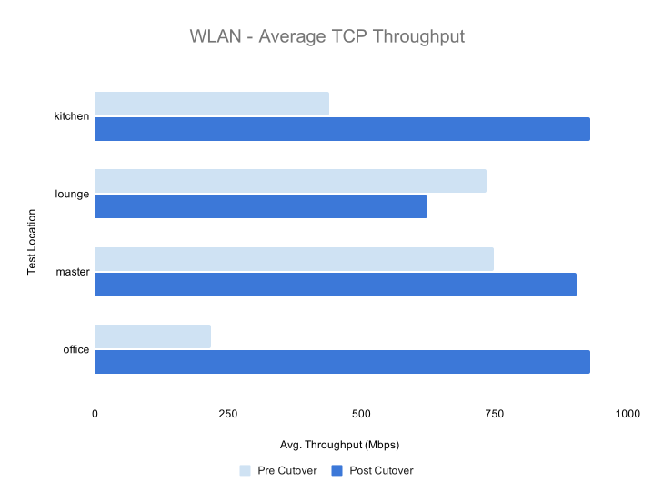
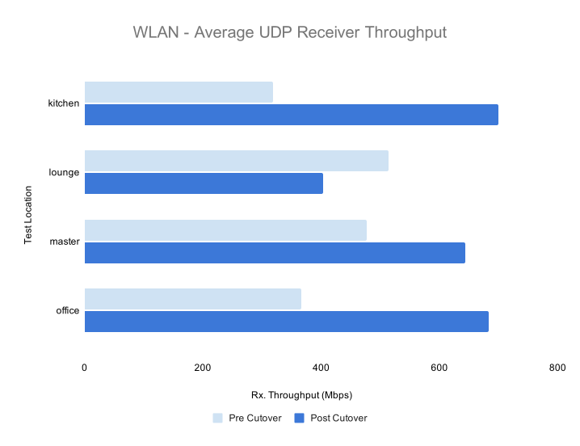
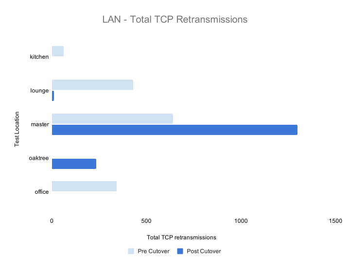
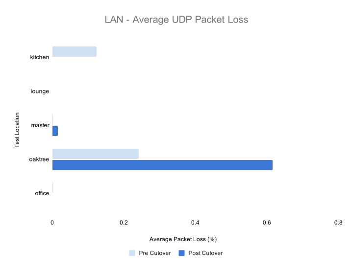
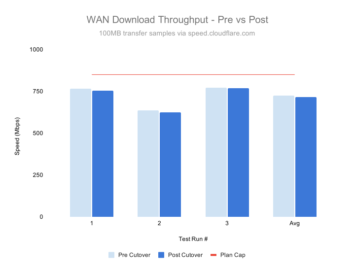
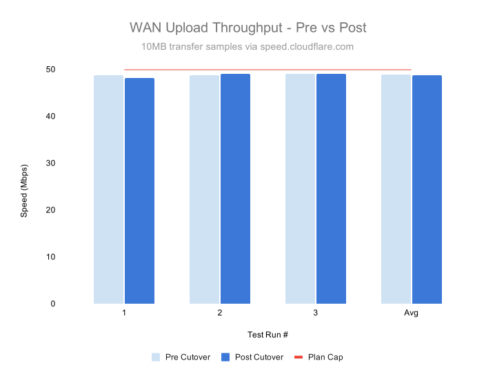

# Serpentine Phase One: OPNsense Cutover Report

## Introduction

Serpentine is a gateway that I built with OPNsense on repurposed
hardware to provide routing, DHCP, and firewall services to a live home
network. I designed it to facilitate network segregation and the
addition of a lab environment without impacting the performance of the
home network. Production also comes with a critical working-from-home
component in addition to serving typical home use, making reliability
and user experience a major focus for design and change management.

This article documents my replacing of a consumer gateway with
Serpentine, along with pre- and post-cutover benchmark analyses to
validate the phase one implementation. I have also highlighted ambiguous
results, and documented observed regressions with accompanying
hypotheses, as a matter of improving subsequent phase planning,
processes, and procedures.

## Phase One Scope and Goals

Phase one was focused on delivering a stable and reliable configuration
that supports future phase implementation without affecting the
production network. To support this and working-from-home reliability,
the following goals were set:

1. Maintain WAN throughput with no measurable regression,
2. Do not degrade network performance,
3. No uncontrolled configuration changes - amendments are reasoned,
logged, and recoverable,
4. Target uptime availability of 99.95%, or ~20 minutes downtime per
month.

VLANs, IDS, VPN, and DMZ configurations, including the addition of a
managed switch and improved WAP hardware, are planned for future phases
[^artefact-1].

## Design

The Eero 6 Plus is a consumer wireless router with extremely limited
administrative controls that prevented me from safely segregating a lab
and production network. Limited logging and live observation facilities
made it difficult to accurately troubleshoot issues, and impossible to
observe network traffic. The Eero also lacks DHCP lease control and
interface management options necessary for safely serving two networks
with distinct risk profiles.

Additionally, the previous topology used a wireless backhaul to support
mesh functionality, which limited throughput available to wireless
clients, and degraded stability and performance for UDP applications,
such as video conferencing and live streaming.

The new topology replaced the master Eero with custom hardware running
OPNsense to serve as the gateway, retained the Eero mesh as wireless
access points, and upgraded the child node with a 1GbE wired backhaul to
improve wireless connection stability and bandwidth. A small form factor
desktop with an extra network card was used for the gateway to provide
three interfaces: one for WAN, LAN, and the future lab.

## Design Decisions

### OPNsense instead of pfSense or consumer router

I chose OPNsense as the router and firewall operating system because it
offers observability, granular firewall rule control, and logging, with
the ability to integrate IDS, VPN, and VLAN without additional hardware.
My prior experience with OPNsense and underlying FreeBSD[^opnsense-docs]
aid in reducing cutover and misconfiguration risk when compared with
other viable options like pfSense. This allowed me to focus on sound
setup and networking without the added burden of learning a new system.

### Repurposed business desktop over purpose-built hardware

This hardware initially needs to handle routing, DHCP and DNS services,
and firewall functionality, which the Optiplex 7060's 6-core i5-8500 and
8GB of RAM handles comfortably: the Eero it replaces is a dual core 1GHz
CPU with 512MB of RAM[^eero-specs]. I chose this modern, 6 core
processor over a slightly faster 4 core option to maintain performance
goals while supporting the introduction of CPU intensive services as the
project progresses. Services such as IDS with curated rulesets and a
WireGuard VPN server demand thread availability and processing power to
maintain optimal performance in a home network. While I expect 8GB of
RAM to be sufficient in handling the planned workload, the expandable
form factor of the Optiplex will allow me to upgrade easily if my
requirements change.

In my initial research, second hand off-the-shelf solutions from
Protectli, and even a Sophos XG 135, were considered, but I ruled them
out because they offered less flexibility for the intended upgrade path.
Used rack equipment was also ruled out due to my concerns with
electricity consumption and noise in a home environment. Conversely, the
Dell Optiplex SFF is power-efficient, quiet, and is sufficient to the
demands of the project.

### Lab network segregation

While the Eero 6 Plus is a capable router for consumer home networking,
it does not provide the physical or logical mechanisms to safely isolate
experimental traffic from production. I therefore reserved Serpentine's
onboard interface `em0` for future physical segregation to support the
planned lab environment. Additionally, the lab network will have a
separate address block from production, in conjunction with VLANs
enforced at the layer two level with a managed switch and 802.1q
tagging, and at the layer three level with VLAN routing on Serpentine.

These physical and logical reservations will enable me to safely conduct
experiments and expose services to the public in future phases, while
containing the lab's potential blast radius and preventing failure from
propagating to the production network.

### Topological placement of the master Eero

Eero officially recommends placing the master node upstream of the
switch when using 'Bridge Mode' because their proprietary mesh requires
a master node to act as the single upstream gateway for all downstream
nodes[^eero-support].

### IP addressing scheme

The RFC 1918 16-bit block[^rfc1918] is the designated block for my
homelab as it provides 65,534 usable addresses - more than sufficient
for Serpentine's foreseeable requirements - and I've used it across my
home networks for years, which significantly mitigates misconfiguration
risk and aids log auditing. I've further subnetted the /16 into 24-bit
blocks to provide 256 usable networks, and made allowances for carving
out smaller blocks per network: the production network has been assigned
192.168.1.0/24 for 254 hosts. The lab, designated 192.168.100.0/24, will
be further divided to support lab network services, such as the VPN
server and DMZ. These designations provide Serpentine room to grow into
logical segmentation as future phases require it, while satisfying
project goals of maintaining production reliability.

### Intel i350-T2 NIC (Lenovo OEM branded)

I needed an additional NIC because the Optiplex 7060 only has one
onboard interface and my topology requires three: one for WAN, one for
LAN, and one reserved for lab. Aside from meeting topological
requirements, I chose the Intel i350-T2 for its reliable performance
under sustained loads and known driver compatibility on
FreeBSD[^freebsd-docs] - the underlying operating system for OPNsense -
when compared to other brands. Specifically, Realtek chipsets often
require manual driver installation and maintenance, significantly
increasing the risk of unplanned downtime on the production gateway
where software updates have the potential to drop WAN and LAN
connectivity simultaneously.

## Risk and Change Management

### Risk Assessment

I carried out an informal risk assessment proportionate to project scope
using a likelihood-by-impact method to prioritise my mitigation efforts.
Six risks were identified in my assessment[^artefact-2], with the
following two highlighted for their impact on cutover.

Key Risks:

1. Unable to gain a WAN IP address via DHCP
	- Likelihood: Medium
	- Impact: High
	- Mitigation: ensure WAN interface is configured for DHCPv4 only
	  in pre-configuration steps
	- Occurred at cutover. An active DHCPv6 gateway conflicting with
	  my ISP's DHCPv4 configuration. I disabled the DHCPv6 gateway,
	  reset the WAN interface, and confirmed WAN connectivity before
	  backing up the updated configuration. This event was logged in
	  the setup log and is expanded on further in the Execution
	  section below.
2. New topology introduces wireless mesh performance regressions
	- Likelihood: Low
	- Impact: Medium
	- Mitigation: Attempt Eero-downstream topology and re-test; last
	  resort use one Eero only, execute rollback if performance is
	  too poor
	- Partially occurred, realised in benchmark analysis -- see the
	  Results section below.

### Change Management

The main factors that guided me in change management were to ensure that
household users experienced minimal impacts to their network use and
could plan around the maintenance window. I always wanted to ensure that
my stated goals had the greatest chance of success, so I put in place a
rollback plan where, if cutover failed, service could be
restored[^artefact-2].

My first step was to develop a pre-cutover checklist containing a
step-by-step implementation guide, including hardware configuration
steps, backup plans, IP address scheme, a rollback plan, and
benchmarking. This ensured that I could carry out implementation and
configuration steps deterministically during cutover, while supporting
accurate logging in live execution.

I planned for the maintenance window to last 4 hours total; allowing 2
hours for implementation, a 1.5 hour buffer for troubleshooting and
debugging, and a 0.5 hour rollback buffer. This was a deliberately
conservative estimate to provide adequate headroom for unplanned
circumstances and failure, while maximising my chances for a successful
execution.

After tentatively scheduling the cutover for May 8, 2026, 21:00-01:00, I
initiated a discussion with the household on May 5 to propose the time
and understand user requirements. This included confirming that the
window was suitable for all users, and a non-technical overview of the
physical works. I finalised the time and advised members they would
receive a notice fifteen minutes prior to loss of connectivity, and
could request postponement if needed. I gave verbal notice on May 8,
2026, 20:45 as planned.

As a contingency against cutover failure, I developed a rollback plan
with clear trigger criteria that required its execution if less than one
hour of the maintenance window remained. This was to ensure that the
household would regain network connectivity after the maintenance window
regardless of the outcome. With the trigger defined, I designed the
rollback to implement the previous topology while retaining the improved
1GbE wired backhaul on the child node. The plan was a step-by-step
checklist for configuring the Eero to automatic mode and replacing
Serpentine with the master node to re-establish it as the gateway.

To support the goal of making controlled configuration changes and
auditing, I established procedures that enforce strict management. They
dictate that all configuration changes must be reasoned and planned
prior to implementation. While unlikely, security incidents needing my
immediate attention are exempt from the planning requirement, although
logging and backup still apply. Otherwise, if I make a change, I log it
and manually back up the new configuration. This protects against
working configuration loss and provides a clear rollback path if my
changes cause failure, and reduces the risk of overrunning a maintenance
window.

## Execution

Serpentine/OPNsense was configured offline and the DHCP service tested
via LAN prior to the maintenance window, so that cutover was only a
physical swap of hardware.

The cutover started on time, including pre-start checks to validate the
offline configuration, and confirm the topology and implementation plan
were accessible. Once I configured the Eeros to Bridge Mode, the master
node was physically swapped with Serpentine, and I established a wired
connection with a LAN host for setup.

The first issue showed up almost immediately: the WAN interface did not
obtain an IPv4 address[^artefact-3]. Rather than assuming a cabling or
ISP issue, my first step was to check the firewall Live View. The logs
showed outbound DHCPv6 requests with no response which was expected
behaviour given my ISP operates on DHCPv4. After reviewing the gateway
configuration, I identified the likely reason for the DHCPv6 requests:
an active `WAN_DHCP6` gateway entry. An attempt to remove it failed, as
OPNsense prevented deletion while 'Prevent interface removal' was
enabled on the WAN interface.

After disabling that option, I also needed to explicitly set the WAN
interface IPv6 configuration type to 'None' before I was able to remove
the DHCPv6 gateway. Once removed, I disabled and re-enabled the
`WAN_DHCP4` gateway to initiate a new DHCP request.  The firewall Live
View logs then displayed inbound DHCPv4 responses from the expected
CGNAT address range, and the Dashboard confirmed the WAN interface was
active and received a lease from my ISP. I then confirmed IP
connectivity and DNS resolution using a web browser to request an
external hostname on the connected LAN host.

Once this was resolved and a configuration backup was made, I carried
out the initial cutover steps without issue, which included updating the
Serpentine system, setup of physical topology, and validation of
wireless client connectivity. During physical topology installation, I
identified and implemented an improvement to switch-to-patch-panel port
assignments. This change was logged with a task to update the
post-cutover topology plan.

After confirming that WLAN connectivity had WAN access, I communicated
to the household that the network was restored and to report any issues.

## Benchmarking Methodology

I developed a benchmarking method to track networking performance
metrics as design, configuration, and features evolve[^artefact-4]. Key
metrics included latency standard deviation as an indicator of LAN and
full stack network stability, TCP throughput and retransmissions, and
UDP throughput, jitter, and packet loss to investigate connection and
connectionless application performance. Internal LAN ICMP requests are
used to gauge LAN network behaviour, while requests to an external host
measure the complete network path through the client, AP, gateway, and
WAN. Transmission tests provide insights on LAN throughput and
connection performance, where TCP retransmissions can be indicative of
lower layer link reliability, while slow UDP throughput and/or high
jitter reflects poor live-streaming application performance.

Each testing set contains the following:

- 100 ICMP requests each to a LAN host, the gateway, and an
  external host (1.1.1.1, represented as 'ip' in the data) with
  `ping`
- 30 second TCP transmission with `iperf3`
- 30 second UDP transmission, capped to 700Mbps with `iperf3`

Locations in the data represent the physical placement of the wireless
client executing the benchmarks: lounge, kitchen, office, and master are
wireless to wired anchor (oaktree) paths with respect to LAN data.
However, the 'oaktree' location in LAN tests represents a wired to
wireless host path, with the location of the wireless client being
anchored to the lounge.

To further aid in producing reliable results, I carried out tests at all
five locations with the same hosts, with almost exact wireless host
placement, under zero load conditions. Each set of tests is then
conducted three times per location, which constitutes a 'run', with five
minute wait intervals between each set to account for networking
conditions. I automated this process with a bash script to reduce human
error and ensure the methodology is carried out accurately.

Test output is captured as plain text files with the naming convention
`LOCATION_TEST_DATE.txt` and organised by session (e.g., 'pre-cutover')
to allow comparisons across runs and network phases. Automating data
compilation required more development time than I could justify for
phase one, so I deferred this to phase two while accepting that manual
delivery can be error prone.

Three sessions were carried out in total, a pre-cutover baseline, an
initial post-cutover run that was contaminated, but useful in
determining any immediate networking regressions resulting from the
cutover, and a clean re-run in controlled conditions for more accurate
analysis[^artefact-5]:

1. 260507-pre-cutover: clean data produced in controlled environment
with zero user activity.
2. 260508-post-cutover: contaminated data produced in dissimilar network
conditions in an uncontrolled environment with user activity.  Initiated
on the night of cutover and completed the next morning (260509). Not
used in final analysis.
3. 260513-post-cutover: clean post-cutover re-run in controlled
environment with zero user activity. Data used in final
analysis.

## Limitations

The following identifies key areas where my results are limited by the
methodology I established, and where possible, how I accounted for these
limitations in my final analysis. It also reveals how the method can be
improved in preparation for the next phase.

I did not record the associated Eero node or signal strength as part of
my testing method. Location based improvements for wireless metrics
could therefore reflect a stronger association to a different node,
rather than a result of an improved topology. However, post-cutover
wireless results recorded significant jitter and LAN latency standard
deviation improvements across most locations, which is indicative of the
topology change rather than node association.

All LAN throughput tests in phase one involved a wireless path with no
measurement for a wired to wired LAN path. As a result, I cannot isolate
wired throughput from wireless metrics and provide clear analysis on
switch, NIC, and cabling performance. As part of phase two, I will
include wired-to-wired host tests in the benchmarking method.

The `benchmarker.sh` script does not have an initial wait period to
allow for clean client-node association prior to the test. This risks
capturing mesh handoff events that can appear as anomalies, one of which
occurred in the lounge. To mitigate against this, I investigated
anomalies and developed a hypothesis, providing a resolution or a clear
path for further investigation. I will also update my benchmarking
script to include a wait period prior to test execution to allow
client-node association to stabilise.

Manually compiling test results introduces risk of error. To ensure I
transcribed results accurately, I cross referenced figures against the
raw output and double checked any anomalies. Starting with phase two,
this will be automated with Python.

## Results and analysis

The following results highlight the most impactful findings from my
analyses of the compiled pre- and post-cutover benchmark
data[^artefact-6].

### 1. WLAN latency stability improvements

Pre-cutover, WLAN latency standard deviation averaged 12.994ms, and
averaged 4.462ms post-cutover, which represents a 65% reduction in
latency jitter on average. These improvements are skewed heavily by the
master and kitchen location reductions, however, WLAN UDP test results
recorded a similar 64% reduction of jitter with no notable regressions.
The lounge and office locations recorded increases of 1.921ms and
1.317ms respectively in standard deviation for a decrease in stability,
which is not a minor increase relative to baseline measurements.

This could indicate a general WLAN network stability improvement as a
result of the child Eero gaining a wired 1GbE backhaul, which is
consistent with the generally stabilised latency and improved transport
reliability. Wireless events could explain regressions discovered in the
master and kitchen locations, which requires a re-test with larger
sample sizes to verify.

### 2. Wireless LAN throughput significant increases in almost all locations

WLAN TCP throughput increased from 535Mbps to 847Mbps (+58%), and UDP
throughput also improved from 419Mbps to 608Mbps (+45%). Household users
also reported improvements to upload throughput which is consistent with
these results.

The likely explanation is that the new wired 1GbE backhaul freed up
wireless bandwidth for client use that was being utilised by the mesh
backhaul in the pre-cutover topology.

### 3. Master room shows anomalously high regressions post-cutover

The master location recorded a significant increase in TCP
retransmissions, from 640 to 1998, despite seeing improvements in TCP
throughput and LAN latency. Additionally, UDP packet loss increased from
0.002% to 0.016% on average.

Post-cutover, the location of the second (upstairs) Eero changed, which
increased the physical distance from the master location slightly and
added significant amounts of line of sight obstacles. While the observed
improvements in TCP throughput and LAN latency are most likely the
result of the second Eero gaining a 1GbE backhaul, the regression in TCP
retransmissions and UDP packet loss combined with differing physical
placement could indicate a degraded signal path (i.e., RF interference).

To confirm this theory, the topology would need to be rolled back and
re-tested, requiring significant planning to accommodate uptime and
WFH availability constraints. Further tests should be conducted on
the current topology to develop a significant sample size to rule out a
network anomaly.

### 4. Wired host oaktree throughput and TCP+UDP anomalies

Pre-cutover, the wired host recorded an average UDP packet loss to a
wireless host of 0.242% which increased significantly to 0.616%
post-cutover, while UDP throughput and jitter remained steady.
Similarly, 0 TCP retransmissions were recorded pre-cutover which
increased to a total of 88, however, TCP throughput regressed from
755Mbps to 624Mbps.

This TCP throughput regression is nearly identical to the results
recorded in the lounge that could indicate a lounge-specific regression
or interference, which required a review of the raw TCP results.

Analysis of the output from test 2 `wired-oaktree-tcp-2605131245.txt`
reveals the source of the 88 retransmits and illustrates a possible
mid-test mesh hand-off or other wireless signal interference. The test
demonstrated speed fluctuations followed by a single burst of
retransmissions before recovering and stabilising. Initially, a speed of
334Mbps was recorded before quickly recovering to around 600Mbps; this
was followed by a sudden drop to 226Mbps, then 312Mbps, and finally
225Mbps where the 88 retransmissions occur. Throughput recovers
to around 600Mbps and higher, in line with test runs 1 and 3, suggesting
an anomaly rather than a demonstrable regression.

To mitigate against such anomalies in the future, the `benchmarker.sh`
script should include an idle period of 30-60 seconds prior to test
execution to accommodate the settling of mesh WAP association for
clients. Additionally, to ensure future tests are consistent and a true
representation of the network performance, the Eero association along
with client signal strength should be recorded and incorporated as data
points.

A re-test is required to confirm either an anomaly or a regression in
topology.

### 5. WAN throughput retained post cutover

[Chart: WAN Download Results]

In pre-cutover testing, the wired anchor recorded an average download
speed of 724Mbps on Cloudflare's 100MB tests, with post-cutover results
reporting an average 716Mbps. These figures varied from 625Mbps to
771Mbps across both runs. I observed similar results in upload
throughput, recording an average of 49Mbps in both network states.

[Chart: WAN Upload Results]

These averages represent around 85% and 98% utilisation with my plan
being rated for 850Mbps down / 50Mbps up. The Eero interface also
reported little variation between WAN speeds pre- and post-cutover,
consistent with the Cloudflare results. The difference between actual
and rated download speed is more indicative of a layer seven application
not delivering absolute throughput, rather than a signal that the new
topology degraded WAN performance.

## Conclusion

Phase one produced mixed results compared with the success criteria, and
highlights specific gaps in measurement and methodology that prevented a
concrete verdict:

| Goal	 	      | Target	 		       | Outcome       |
|:--------------------|:-------------------------------|:--------------|
| WAN Throughput      | No measurable regressions      | Met	       |
| Network Performance | No degradation		       | Partially Met |
| Change management   | Changes logged and recoverable | Met	       |
| Uptime	      | 99.95% availability	       | Not Assessed  |

Benchmark results indicate that WAN throughput was maintained within the
limits of my chosen method, while change management goals have been met.

Network performance was only partially met due to one anomaly in the
oaktree results with an hypothesis pending a retest, and one unresolved
regression in the master location requiring further investigation.
Additionally, a gap in my benchmarking methodology that excludes a
specific wired-to-wired host path prevents validation of wired LAN
performance specifically.

Availability targets were not assessed because I conflated OPNsense
dashboard uptime with service availability, and didn't establish an
accurate method of measurement before setting the goal. This ultimately
left me with no data to reliably determine whether the target was met.

Operationally, Serpentine successfully replaced the consumer gateway and
established a controlled foundation for introducing the lab environment.
Phase one also identified specific gaps in my benchmarking and
operational measurement, providing me with a clear path for correction
in the coming stages.

### Lessons

#### 1. An availability target without a defined indicator left the goal unmeasurable

In attempting to assess uptime, I realised that I had conflated the
'Uptime' figure - a measure of host uptime - in the OPNsense dashboard
with WAN availability. As a result, I hadn't defined goal specific
targets, measurements, or supporting tools, which prevented me from
reliably determining the outcome of the broad '99.95% uptime' goal.  In
future phases, uptime goals must be accompanied by a defined measurement
method and required tooling before uptime targets are set.

#### 2. Deviating from the maintenance window caused contaminated benchmark results

After completing the cutover, I conflated restoration of network
services with change validation, which prematurely ended controlled
conditions before I had completed benchmarking. The resulting data was
contaminated with network activity and was not representative of the
pre-cutover test conditions, so I couldn't use it for a clean analysis,
outside of briefly determining if any significant regressions occurred.
This necessitated a re-test and additional planning around general use
and WFH requirements to replicate the baseline testing conditions. As
part of future planning, change validation and benchmarking will be
explicitly defined as stages during the maintenance window prior to
communicating service restoration, and should similarly be accounted for
in window planning.

#### 3. Lack of explicit configuration can cause unintended failures

While the maintenance window felt excessive during design, it ultimately
proved beneficial in absorbing a live debugging incident without
requiring a rollback. The WAN incident arose from an assumption that the
interface would behave accordingly without explicitly disabling DHCPv6.
Going forwards, all configuration settings should be explicitly disabled
rather than assumed inactive to minimise misconfiguration risk, and
establish best practices where default behaviour can't be guaranteed.

### Open Actions

The following items have been deferred from phase one, which will be
resolved prior to phase two initiation and documented accordingly.

Serpentine:
- add users:
	- one read-only web GUI user for observation
	- one sudo user for administrative operations
- add external DNS and disable WAN override;
Network Design:
- update topology with switch<->patch panel port numbers.
Benchmarking:
- `benchmarker.sh` amendments:
	- add initial idle configurable period
	- record and store Eero association (required)
	- record and store Eero signal strength (optional)
- update `serpentine-benchmarks` spreadsheet to accommodate eero
  association and signal strength
Monitoring:
- create and maintain Serpentine downtime log

### Phase Two

Phase two introduces intrusion detection via OPNsense, with a success
criteria of defined ruleset configuration, and no measurable throughput
regressions confirmed by pre/post benchmarking. IDS has been prioritised
over networking segmentation as it has no hardware dependencies and can
be layered on to the existing infrastructure cleanly. Phase three will
introduce a managed switch and VLAN segmentation in preparation for a
publicly exposed DMZ.

## References

[^opnsense-docs]: OPNsense Documentation - FreeBSD
  https://docs.opnsense.org/relations/freebsd.html

[^eero-specs]: Eero - Eero 6+ Specifications
  https://eero.com/shop/eero-6-plus

[^eero-support]: Eero Support - What Is Bridge Mode?
  https://support.eero.com/hc/en-us/articles/208276903-What-is-bridge-mode

[^rfc1918]: RFC1918 - Address Allocation for Private Internets, ss. 3. Private Address Space
  https://datatracker.ietf.org/doc/html/rfc1918

[^freebsd-docs]: FreeBSD 14.3 Hardware Notes - Ethernet
  https://www.freebsd.org/releases/14.3R/hardware/#ethernet

[^artefact-1]: Project Artefact 1 - Serpentine Project Overview
  https://github.com/s6muel/Serpentine/blob/main/docs/architecture/project-overview.md

[^artefact-2]: Project Artefact 2 - Phase One Implementation Plan
  https://github.com/s6muel/Serpentine/blob/main/docs/phases/01-cutover/implementation-plan.md

[^artefact-3]: Project Artefact 3 - Phase One Setup Log
  https://github.com/s6muel/Serpentine/blob/main/docs/phases/01-cutover/setup-log.txt

[^artefact-4]: Project Artefact 4 - Benchmark Methodology
  https://github.com/s6muel/Serpentine/blob/main/docs/phases/01-cutover/benchmark-method.md

[^artefact-5]: Project Artefact 5 - Phase One Benchmark Data
  https://github.com/s6muel/Serpentine/tree/main/data/benchmarks/01-cutover

[^artefact-6]: Project Artefact 6 - Benchmark Analysis Spreadsheet
  https://docs.google.com/spreadsheets/d/1w_0cToFA3ZQH7Ja0yRGacq3VAepFi1VUEhrT5V05hGM

